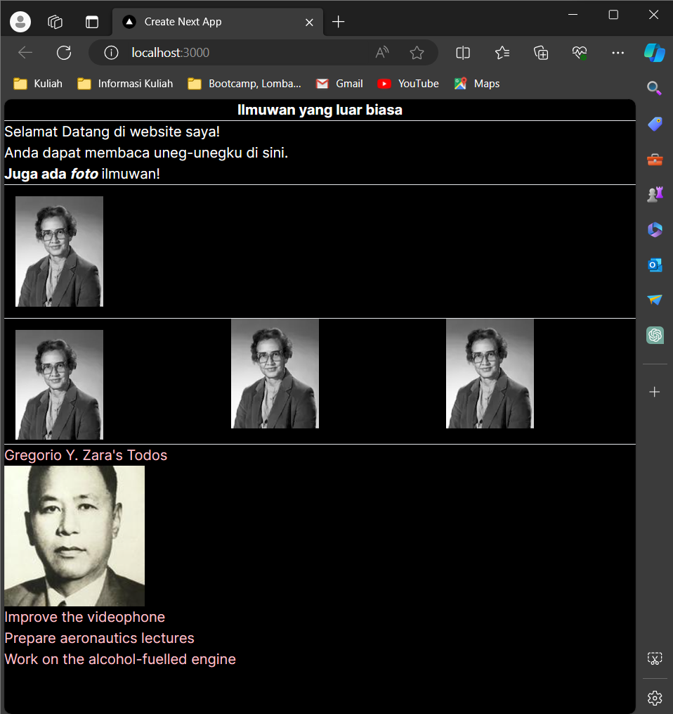

This is a [Next.js](https://nextjs.org/) project bootstrapped with [`create-next-app`](https://github.com/vercel/next.js/tree/canary/packages/create-next-app).

## Getting Started

First, run the development server:

```bash
npm run dev
# or
yarn dev
# or
pnpm dev
# or
bun dev
```

Open [http://localhost:3000](http://localhost:3000) with your browser to see the result.

You can start editing the page by modifying `app/page.tsx`. The page auto-updates as you edit the file.

This project uses [`next/font`](https://nextjs.org/docs/basic-features/font-optimization) to automatically optimize and load Inter, a custom Google Font.

# **Laporan Praktikum**

|  | Pemrograman Berbasis Framework 2024 |
|--|--|
| NIM | 2141720004 |
| Nama | Alya Marliza Koesnanto |
| Kelas | TI - 3A |
| | |


## **Jawaban Soal 1**

Saya sempat mengalami error pada saat URL gambar tidak mau muncul atau tidak terdeteksi. Ternyata saya harus menambahkan sekaligus mengkonfigurasi pada file _"next.config.mjs"_ yang dimana harus ditambahkan konfigurasi host agar dapat mengakses laman [i.imgur.com](i.imgur.com/MK3eW3Am.jpg).

Berikut kode pemrograman yang ditambahkan


## **Jawaban Soal 2**

Ada perubahan. Pada saat praktikum pertama, contoh gambar yang harus ditampilkan pada website localhost ada 3 gambar yang saling bersebelahan yang dimana pada akhirnya saya memilih untuk melakukan implementasi contoh kode pemrograman dari praktikum ke-2 ke praktikum ke-1 seperti ini:


Namun, dipraktikum ke-2 ini membuat komponen baru bernama _"gallery"_ dengan format tsx dan mengisi file tersebut dengan kode pemrograman seperti dicontoh. Ternyata saat komponen tersebut diimpor pada file _"page.tsx"_ terjadi perubahan seperti gambar diatas, yang awalnya 3 gambar menjadi 4 gambar.

## **Jawaban Soal 3**

Kode saat sebelum diperbaiki:


Kode setelah diperbaiki:


Hasil Kode setelah diperbaiki:


## **Jawaban Soal 4**

Sebelum diperbaiki:


Sesudah diperbaiki:


Hasil dari perbaikan:


## **Jawaban Soal 5**

Ya, terdapat perbedaan antara hasil dari Nomor 4 dengan Nomor 5

Kode Pemrograman:


Hasil:


## **Jawaban Soal 6**

Kode Pemrograman setelah diperbaiki:


Hasil jika nilai imageSize dirubah menjadi "b":



Ukuran gambar terlihat agak besar daripada sebelumnya.

## **Jawaban Soal 7**

## **Jawaban Soal 8**

## **Jawaban Soal 9**